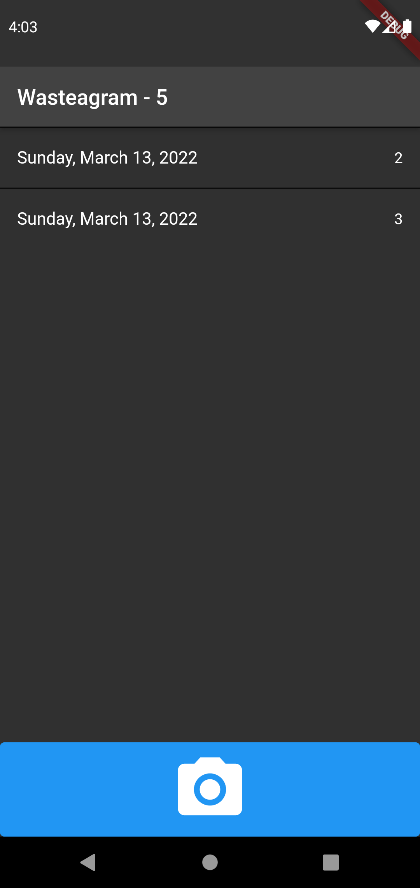
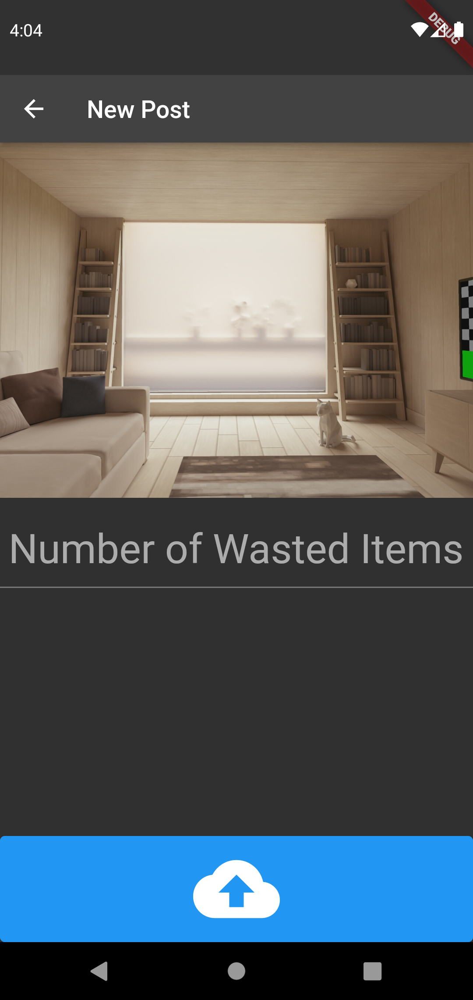
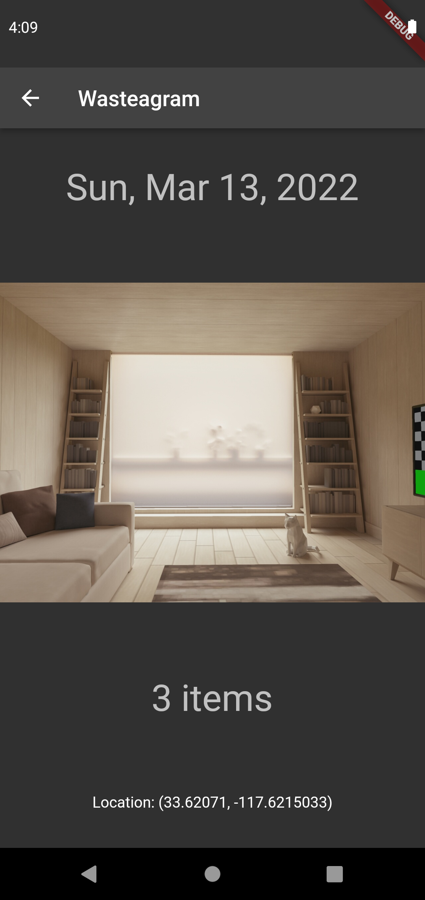

# Mobile Software Development Portfolio Project - "Wasteagram"

Basic mobile app for documenting food waste. Each post contains a user-selected photo, and number of waste items, as well as date and location data.

## Example Usage

#### The main screen shows previous posts.

#### Tapping the camera icon prompts you to select an image from your gallery, then shows the post creation screen. Input the number of wasted items, then press the upload button to upload your post.

>Note: Uploading is currently disabled in this demo app.

#### From the main screen, tap a previous post to display more information.

